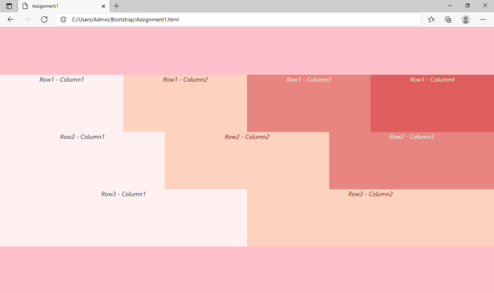

## _Day 1: Introduction to Bootstrap_
### _Assignment:_
* ### _Create a full width container with exact same height and width as screen and create 4 columns in first row, 3 in second row and 2 in third row with some dummy text and align all rows in the center of the screen. All the columns will have a height of 150px._
---

---
