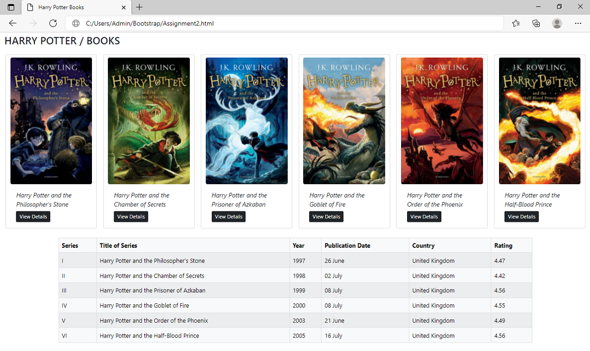

## _Day 2: Lists, images and tables_ 
### _Assignment:_
### _1. Create a Container with six cards having different images and titles with proper buttons._
### _2. Below the card container create a table for any dummy data with six rows and 6 columns._
---

---
