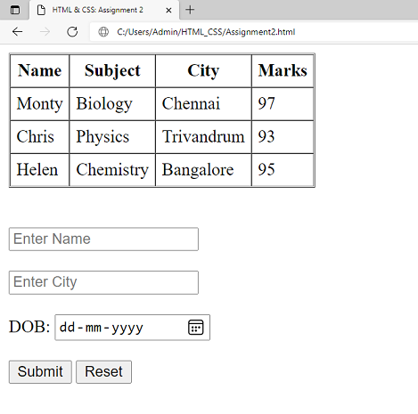

## _Day 2: Tables & Forms_
### _Assignment:_ 
### _1. Create an html file that contains a table with name, subject, city, marks columns and 3 rows of data._
### _2. Create a form with name, dob, city fields with validation._
---

---
