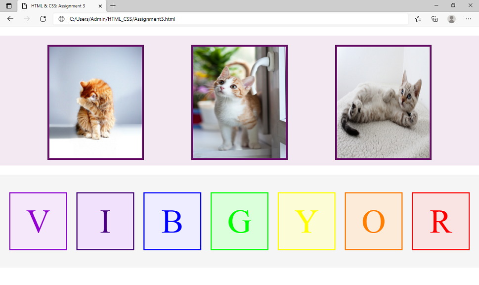

## _Day 3: CSS Basics_
### _Assignment:_ 
### _1. Create a section and put 3 childs in it with even gaps and put one image each in the child divs._
### _2. Create another section and put childs with even gaps._
### _Both should be in the same page._
---

---
