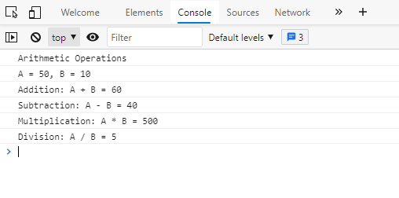

## _Day 1: Basics of JavaScript_
### _Assignment:_
* ### _Create two variables and perform all arithmetic (addition, subtraction..etc) operations and print the result in the console using templating syntax._
---

---
