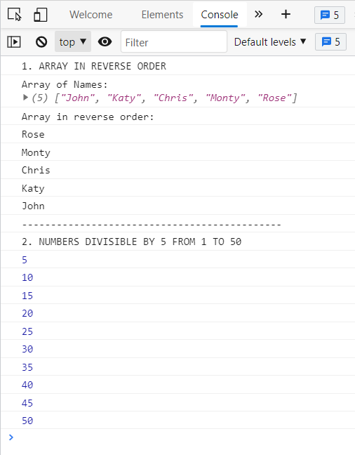

## _Day 2: Conditional Statements & Loops_
### _Assignment:_
### _1. Create an Array with five names and print all five in reverse._
### _2. print only the elements which are divisible by 5 from 1 to 50._
---

---
